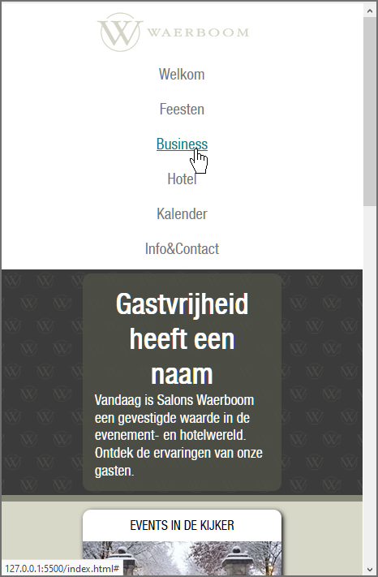
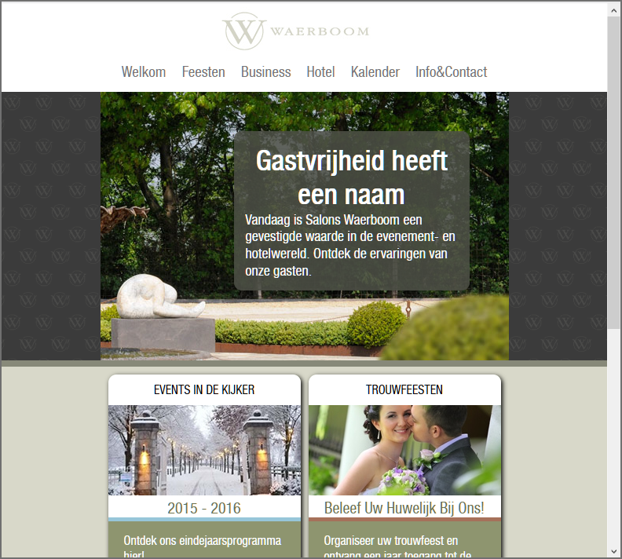
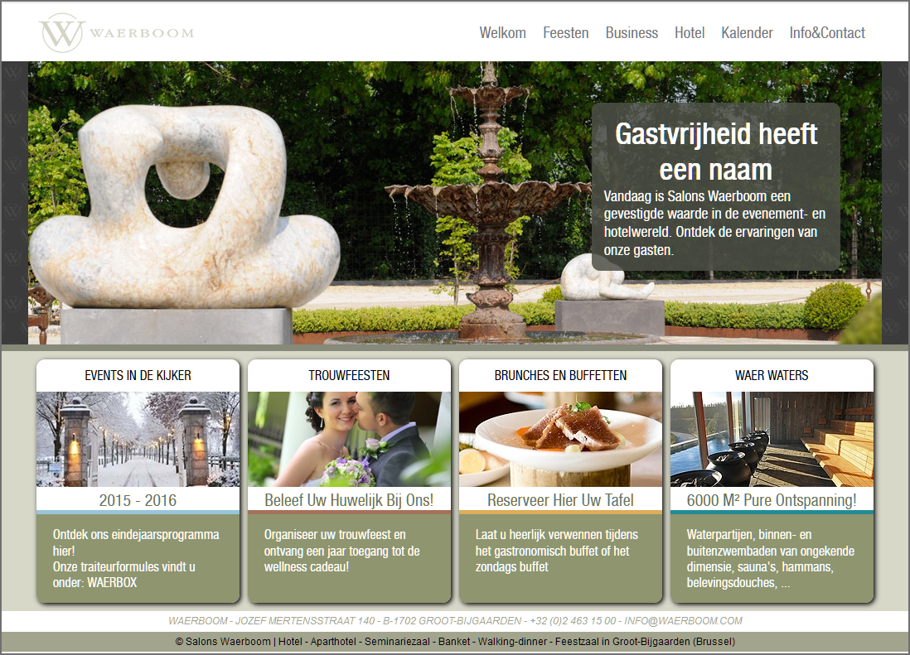

# Les 11 - Starter oefeningen H11-12 - Tekst - Typografie - Kleuren

Download of clone deze repository. 
## Oefening 1: Vander Beken - Lettertype

Maak in de vanderbeken-oefening gebruik van het Google-lettertype **Roboto**. 

- Surf naar [https://fonts.google.com/](https://fonts.google.com/)
- Zoek naar het lettertype Roboto en selecteer het lettertype.
- De vanderbeken-website  bevat gewone tekst en cursieve tekst, selecteer dus de styles 'Regular 400' en 'Regular 400 italic'
  en voeg de styles toe aan je website met `@import`. 
  Vergeet niet de font-family te wijzigen naar `font-family: 'Roboto', sans-serif;`
- Bekijk de website in je browser en controleer met de Developer Tools of het lettertype Roboto geladen wordt.

## Oefening 2: Salons Waerboom

De bedoeling van deze oefening is de webpagina **Salons Waerboom** verder afwerken, zie schermafbeeldingen op 
het einde van deze oefening.

1. Open de map **SalonsWaerboom** met de startbestanden in Visual Studio Code. In principe hoef je niets meer te 
   wijzigen aan de HTML-code. Je moet enkel de CSS-code aanpassen. Dit neemt niet weg dat je ook de HTML-code 
   moet bekijken om de CSS-selectors te kunnen bepalen. 

   Daar de achtergrondafbeeldingen/achtergrondkleuren van de hoofdblokken in de webpagina moeten doorlopen over de volledige webpagina, wordt er in **index.html** gewerkt met een `.content-wrapper` om de breedte van de inhoud in te stellen en de inhoud horizontaal te centreren binnen de webpagina.

   We voorzien drie layouts: een layout voor small devices, een layout voor medium devices en een layout voor large devices, zie onderstaande schermafbeeldingen. 
   Bij elke layout werken we met een vaste breedte voor de `.content-wrapper`. Voor small devices gebruiken we 265px, nl. de breedte van een article image (245px), plus twee keer 10px padding. Voor medium devices gebruiken we 520px (2 artikels naast elkaar) en voor large devices gebruiken we 1030px (4 artikels naast elkaar).

   Voor de small devices is de vaste breedte reeds ingesteld in de CSS-file. Ook zijn voor de meeste elementen kleuren, lettergrootte en witruimte al opgenomen 
   in de starter file, zodat je deze niet allemaal zelf moet instellen.

   Voor de paginalay-out gaan we Grid Layout gebruiken met het body-element als 'grid container' en in de starter-file staat voor het body-element reeds `display: grid` ingesteld.

2. De font-family van het body-element staat ingesteld op `font-family: helveticaneue, sans-serif;` maar het lettertype dat zich in de file '**helveticaneue.woff**' (map **fonts**) bevindt, wordt niet geladen. Voeg een css-statement toe zodat het lettertype correct wordt geladen en controleer dit met de Developer Tools.

Probeer vervolgens de webpagina af te werken door te kijken naar de schermafbeeldingen onderaan deze oefening en rekening te houden met onderstaande items of volg de meer uitgebreide stapsgewijze procedure hieronder.
- De navigatielinks hebben een groter lettertype nl. 1,2 rem.
- De jumbotron is 350 pixels hoog voor medium en large devices.
- Het transparante artikel bij de jumbotron is 300 pixels breed en bevindt zich op 50 pixels van de boven- en  rechterrand.

### STAPSGEWIJZE PROCEDURE: ###

We werken Mobile First en maken dus eerst de webpagina op voor small devices. 

**Small devices:**
  
1. Navigatiebalk:
   - Maak de hyperlinks een beetje groter (lettergrootte 1,2 rem) en zorg ervoor dat de links enkel onderlijnd worden als er over gehoverd wordt (zie onderstaande schermafbeelding 'Small device'). De tekstkleur voor de links en voor als er gehoverd wordt over de links vind je bovenaan in het .css-bestand. Werk voor de kleuren van de links met Custom properties (ook CSS variables genoemd). Vervang daarna ook alle andere kleurwaarden in het startbestand door Custom properties. In het startbestand staan de Custom properties reeds klaar in commentaar. Plaats deze uit commentaar en definieer alle Custom properties op de `:root` pseudo-class zodat deze globaal beschikbaar zijn.

     Opmerking: de designer heeft hier wel heel veel verschillende kleuren gebruikt en er wordt nauwelijks een kleur herbruikt, vandaar de wat ongebruikelijke 'naming convention'. Het gebruik van CSS variabelen is hier misschien wat overkill, maar het feit dat alle kleuren mooi samen staan heeft toch een meerwaarde.

   - Maak de lijst met hyperlinks op zoals we in de vorige lessen gezien hebben. Je maakt dus gebruik van flex. In onderstaande schermafbeelding 'Small device' zie je wat je moet bekomen. Geef de hyperlinks in de navigatiebalk 10 pixels padding.
2. Header:
   - het logo is momenteel niet horizontaal gecentreerd binnen de `.content_wrapper`, ook al lijkt het dat het bijna gecentreerd is. Stel `display: flex` in op de `.content_wrapper` binnen de header en centreer logo en nav. 
3. Jumbotron:
   - Stel 'patternslider.png' in als achtergrondafbeelding, de afbeelding moet herhaald worden.
   - Geef de jumbotron een onderrand van 8 pixels (voor de randkleur zie .css-bestand).
   - Voorzie afgeronde hoeken (straal 10 pixels) voor het artikel binnen de jumbotron en centreer de titel van het artikel.
4. De sectie met de vier artikels:
   - Maak gebruik van CSS om in de artikels de hoofdtitel om te zetten naar hoofdletters en om in de subtitel elk woord te laten beginnen met een hoofdletter. 'Trouwfeesten' wordt dus 'TROUWFEESTEN' en 'Beleef uw huwelijk bij ons' 
      wordt 'Beleef Uw Huwelijk Bij Ons'. 
    - Rond de hoeken van de vier artikels af. De straal van de afgeronde (cirkelvormige) hoeken is 10 pixels. Tip: het volstaat niet om de hoeken van 'article' af te ronden. Je moet ook de hoeken van de witte 'header' afronden.
    - De titels in de artikel-headers mogen niet meer vet worden weergegeven en moeten gecentreerd worden.
    - Geef de vier artikels een zwarte schaduw:
      - offset-x: 2px
      - offset-y: 2px
      - blur-radius: 5px
    - Voor de lay-out van de article-elementen gaan we grid gebruiken. Stel nu reeds `display: grid;` in (op het juiste element), ook al is er momenteel maar één kolom, en gebruik de `gap` property om 10 pixels witruimte tussen de artikels te creëren.
   - Elk artikel bevat een verschillend gekleurde lijn (zie schermafbeelding Large device). Deze lijnen zijn de onderranden (5px) van de header-elementen. Gebruik advanced selectors om deze lijnen toe te voegen. De kleuren vind je opnieuw bovenaan in het .css-bestand.
5. Footer:
   - De teksten in de footer zijn horizontaal gecentreerd.
   - Het adres in de footer heeft een witte achtergrond en de tekstkleur vind je bovenaan in de .css-file.

**Medium devices (vanaf 540 pixels)**

1. Het body-element bevat reeds een grid van 4 rijen (impliciet gedefinieerd), met daarin header, jumbotron, article en footer. Geef de rij met de jumbotron een vaste hoogte van 350 pixels.
2. Verbreed de `.content_wrapper` naar 520px (ruimte nodig voor twee artikels).
6. Plaats nu twee artikels naast elkaar.
3. Maak de navigatiebalk horizontaal.
4. Stel 'waerboom-groot.jpg' in als achtergrondafbeelding voor de .content_wrapper in de jumbroton. Zorg er tevens voor dat de .content_wrapper, binnen de jumbotron, alle ruimte inneemt in de hoogte. 
   Stel de positie van de achtergrondafbeelding zo in dat het rechtse gedeelte van de afbeelding zichtbaar is (zie schermafbeelding Medium Device). 
5. Geef het artikel in de jumbotron een breedte van 300 pixels en maak de achtergrondkleur van het artikel een beetje doorzichtig. Gebruik een alpha-value van 85%. 
   Positioneer vervolgens, door gebruik te maken van de `position`-property, het artikel op 50px van de bovenkant en 50px van de rechterkant van de `.content_wrapper`.

**Large devices (vanaf 1050 pixels)**

1. Verbreed de `.content_wrapper` naar 1030px (ruimte nodig voor vier artikels).
2. Plaats de vier artikels naast elkaar.
3. Plaats het logo en het nav-element naast elkaar. Het nav-element moet rechts komen te staan.
4. Stel de positie van de jumbotron-achtergrondafbeelding zo in dat deze gecentreerd wordt (zie ook schermafbeelding Large device).
    
### Schermafbeeldingen:

**Small device**

**Medium device**

**Large device**

